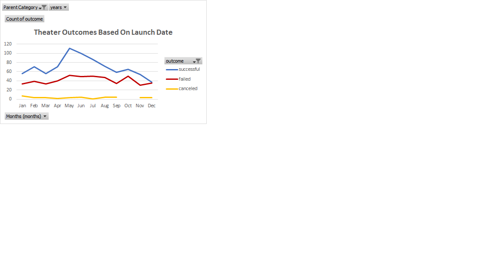

# kickstarter-analysis
## Overview
### Purpose
The purpose of this analysis was to assist Louise who wants to start a crowdfunding campaign for her play with a set budget, by examining the relationship between the launch date of similar campaigns as well as their crowdfunding goals to give Louise a better idea of the likely hood that her campaign will suceed based upon the time of year she begins her campaign and her goal amount.
## Analysis
### Methodolgy how i did stuff talk about data processing 
To begin the analysis I first processed the data by adjusting the date format from a unix time stamp to a date time format using `=(N2/86400)+DATE(1970,1,1)`, `N2` being the unix time stamp the years colum was extracted from the afore mentioned forumla with the function `YEARS()`.
I also processed the category column by splitting parent and subcategory where `R2` is the orginal category column `=LEFT(R2,FIND("/",R2)-1)`. Allowing us to decern wether or not the category influenced the success rate.
I then created a created a new sheet where I inserted a new pivot table on parent category and years where the number of outcomes were summed by month. This created a pivot table which allowed us to see the count of each outcome by month and to plot the data over time.

It felt as though there were some steps missing but I problem solved by looking at the example images in canvas and using backwards planning to find solutions. I had issues with my outcomes based on goals graph because the `40000 to 44999` goal range skewed my data. I then zero'd out the perecentages to produce a graph similar to the ones provided as examples. 

## Results
### Time of launch affects outcomes
A conclusion that can be drawn from the graph below is that there is a much higher sucess rate for crowdfunding campaigns that start between the months of April and August. Another, is that campaigns that begin during the winter and holiday season months November to Janauary have lower chances of suceeding. 

### Goal amount negatively affects outcomes
![image}<---- here
