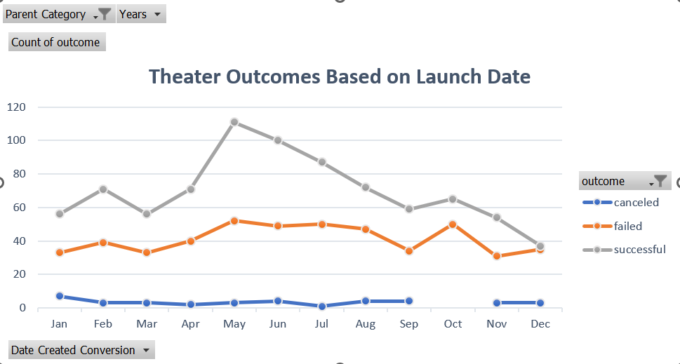

# kickstarter-analysis
## Overview
### Purpose
The purpose of this analysis was to examine the relationship between time and kickstarter success as well as goal amount and success of said campaign.
## Analysis
### Methodolgy 
how i did stuff talk about data processing first the data was processed by adjusting the date format from a unix time stamp to a date time format using `=(N2/86400)+DATE(1970,1,1)` just explain where n2 is the unix time stamp years was extarcted from the afore mentioned forumla with the function `YEARS()`.
I also processed the category column by splitting parent and subcategory with where R2 is the orginal category column `=LEFT(R2,FIND("/",R2)-1)`
pivot table describe the process of making it. created a new sheet where i insereted a new pivot table filtered on parent category and years where the number of outcomes were summed by month. This created a pivot table which allowed us to see the count of each outcome by month and to plot the data over time.

It felt as though there were some steps missing but 'I figured it out' by looking at the example images in canvas and using backwards planning to find solutions.

## Results
### Time of launch affects outcomes

### Goal amount negatively affects outcomes
![image}<---- here
