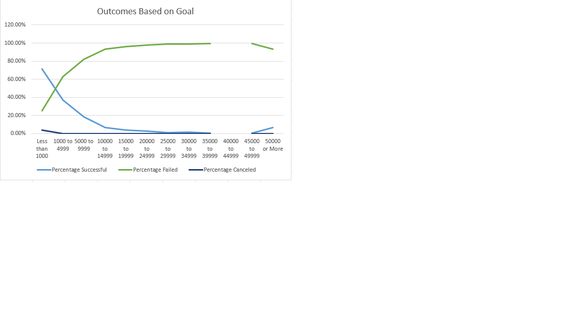

# kickstarter-analysis
## Overview
In module one we help Louise anaylze the data from her crowdfunding campaign. The goal was to help her see how different campaigns perform based on fudning, launch dates, ect. In order to help her see this clearly I downloaded the dataset workbook file and I made a file that was more comprehendable for her. I then could examine and compare the data, allowing me to see what affected and made each campaign perform.
### Purpose
The purpose of this analysis was to assist Louise by cleaning the data provided. Examining the relationship between the launch date of similar campaigns as well as their crowdfunding goals to give Louise a better idea of the likely hood that her campaign will suceed based upon the time of year she begins her campaign and her goal amount via visualations.
## Analysis
### Methodolgy 
To begin the analysis I first processed the data by adjusting the date format from a unix time stamp to a date time format using `=(N2/86400)+DATE(1970,1,1)`, `N2` being the unix time stamp the years colum was extracted from the afore mentioned forumla with the function `YEARS()`.
I also processed the category column by splitting parent and subcategory where `R2` is the orginal category column `=LEFT(R2,FIND("/",R2)-1)`. Allowing us to decern wether or not the category influenced the success rate.
I then created a new sheet where I inserted a new pivot table on parent category and years where the number of outcomes were summed by month. This created a pivot table which allowed us to see the count of each outcome by month and to plot the data over time.
## Challenges
The only challenge I encoutnered was that it felt as though there were some steps missing but I problem solved by looking at the example images in canvas and using backwards planning to find solutions. I had issues with my outcomes based on goals graph because the `40000 to 44999` goal range skewed my data. I then zero'd out the perecentages to produce a graph similar to the ones provided as examples. 

## Results
### Time of launch affects outcomes
A conclusion that can be drawn from the graph below is that there is a much higher sucess rate for crowdfunding campaigns that start between the months of April and August. Another, is that campaigns that begin during the winter and holiday season November to Janauary have lower chances of suceeding. 

### Goal amount negatively affects outcomes
Based upon the graph below the higher the amount for crowdfunding projects the lower the likelyhood of those campaigns reaching their crowdfunding goals. 

## Conclusion
The outcome based on launch date graph tells us that there ultimately were more successful campaigns than those that were failed or cancelled. Unfortunately, based on the outcome based on goals graph, she only has under 60% chance of reaching her budget of over $10,000. Going forward, Louise should stray away from campaigns that launch in the winter and instead focus on May launches. One limitation in the data is that the data does have information from different countries, as well as the groups themselves are very small. 
